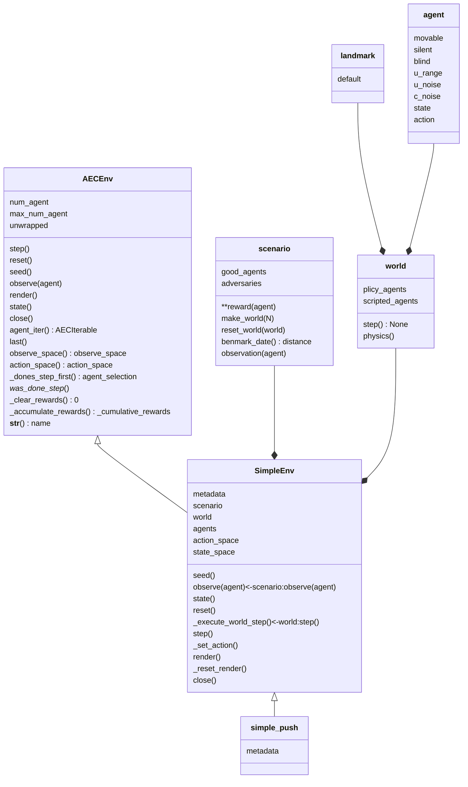

# simple_push

```mermaid
classDiagram
class AECEnv{
    num_agent
    max_num_agent
    unwrapped
    step()
    reset()
    seed()
    observe(agent)
    render()
    state()
    close()
    agent_iter() AECIterable
    last() 
    observe_space()observe_space
    action_space()action_space
    _dones_step_first()agent_selection
    _was_done_step_()
    _clear_rewards() 0
    _accumulate_rewards() _cumulative_rewards
    __str__()name
}
AECEnv<|--SimpleEnv
class SimpleEnv{
    metadata
    scenario
    world
    agents
    action_space
    state_space
    seed()
    observe(agent)<-scenario:observe(agent)
    state() 
    reset()
    _execute_world_step()<-world:step()
    step()
    _set_action()
    render()
    _reset_render()
    close()
}
SimpleEnv <|-- simple_push
class simple_push{
    metadata
    
}
class scenario{
    good_agents
    adversaries
    **reward(agent)
    make_world(N)
    reset_world(world)
    benmark_date() distance 
    observation(agent)
}
class world{
    plicy_agents
    scripted_agents
    step()None
    physics()
}
class agent{
    movable
    silent
    blind
    u_range
    u_noise
    c_noise
    state
    action
}
class landmark{
    default
}

scenario  --* SimpleEnv
world --* SimpleEnv
landmark --* world
agent --* world
```